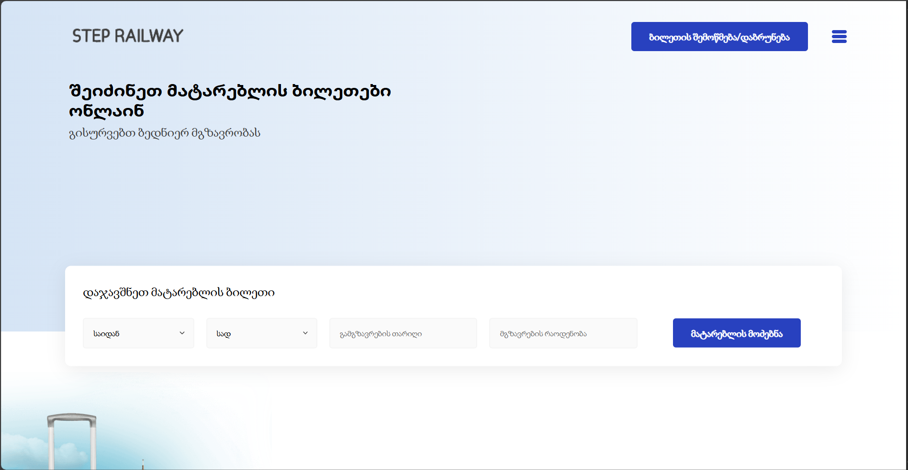
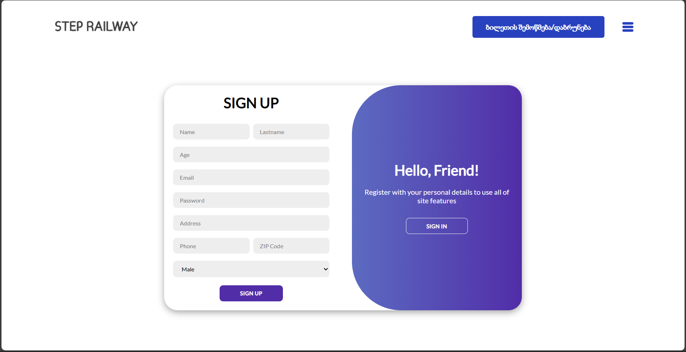

# 🚆 STEP Railway Project

A complete train ticket booking system built as part of my JS project at STEP IT Academy. The system allows users to register, search for trains, select seats, generate tickets, and includes admin functionality for managing users and daily activity.

---

## 🔧 Features

- 🔍 **Train Search** – Find trains by direction and date
- 🎫 **Seat Selection** – Real-time seat availability with color indicators (green = available, red = booked)
- 👤 **User System** – Register, log in, update profile, and reset password
- 👥 **Passenger Entry** – Add multiple passengers with validation
- 🧾 **PDF Ticket Generation** – Auto-generated downloadable ticket
- 📜 **Ticket History** – Stored per user in mockAPI
- ❌ **Ticket Lookup & Deletion** – Search and delete by ticket ID
- 🛠 **Admin Panel** – View users, messages, and today's analytics, fetched from mockAPI
- 💬 **Chatbot** – Basic automated assistant
- 🌍 **Multilingual Support** – Instant language switching (e.g., Georgian/English)

---

## 🛠 Technologies Used

- **Frontend**: HTML5, CSS3, SCSS, Vanilla JavaScript
- **PDF Generation**: jsPDF
- **Storage**: SessionStorage + backend (for tickets and users)
- **Responsiveness**: Media queries, Flexbox, Grid
- **Version Control**: Git & GitHub

---

## 📸 Screenshots




---

## 🚀 How to Run

```bash
# Clone the repository
git clone https://github.com/NikaKvaratskhelia/STEP-RAILWAY-PROJECT.git

# Open index.html in browser
```

> ⚠️ Make sure to allow access to `LocalStorage` and `SessionStorage` in your browser if you’re testing locally.

---

## 🗂 Folder Structure

```
/STEP-RAILWAY
├── assets/
├── js/
├── css/
├── index.html
└── README.md
```

---

## 🙋‍♂️ About Me

Hi, I’m **Nika Kvaratskhelia** — a frontend developer currently learning Angular. I completed my HTML, CSS, and JavaScript course at STEP IT Academy with perfect scores (12/12) and star evaluations on all projects. I love building interactive, user-focused web apps and solving complex logic with clean code.

---

## 📬 Contact

- GitHub: [@NikaKvaratskhelia](https://github.com/NikaKvaratskhelia)
- Email: *(nikakvaratskheliabussiness@gmail.com)*
- LinkedIn: *(https://www.linkedin.com/in/nika-kvaratskhelia-047a55341/)*

---

> _This is an educational project built to demonstrate frontend proficiency. Suggestions and feedback are always welcome!_
